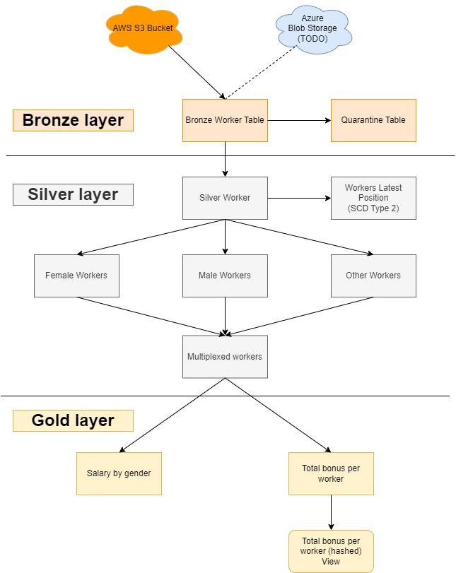

# Delta Live Tables Demo project

The aim of the project was to conduct an experiment on one of the features called Delta Live Tables. The project also encompasses features such as AutoLoader and CDC tables. My objective was to gain a brief overview of these features and concepts.

# Architecture

